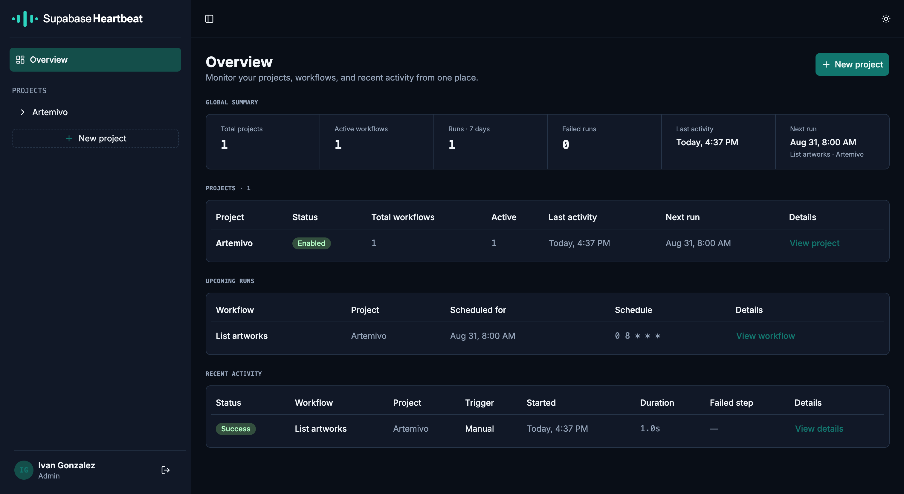
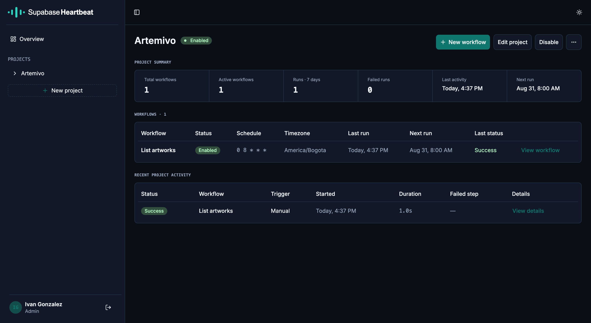
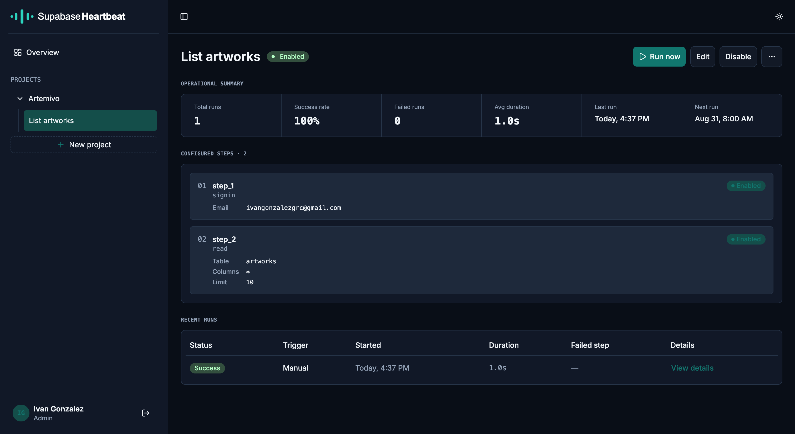
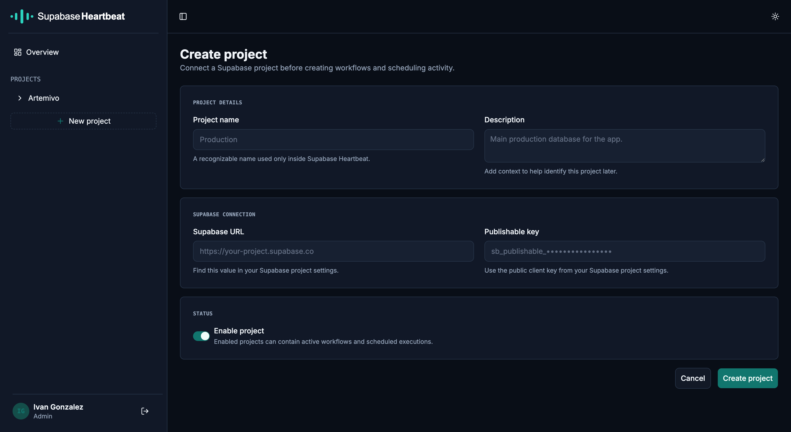

<p align="center">
  
  
</p>

<p align="center">
  Run scheduled Supabase workflows from a self-hosted control plane.
</p>

<p align="center">
  <a href="#license"></a>
  <a href="https://github.com/ivangonzalezg/supabase-heartbeat/releases"></a>
  <a href="https://hub.docker.com/r/ivangonzalezg/supabase-heartbeat"></a>
</p>

Supabase Heartbeat helps teams create, run, and observe scheduled activity against their Supabase projects. Define ordered workflow steps, execute them manually when needed, and enable the built-in cron scheduler when it is time to automate.

> **Early-stage project:** the application is functional, self-hosted, and actively evolving. A license has not yet been established.

## Table of contents

- [What it does](#what-it-does)
- [Screenshots](#screenshots)
- [Quick start with Docker](#quick-start-with-docker)
- [Configuration](#configuration)
- [Local development](#local-development)
- [Database and migrations](#database-and-migrations)
- [Architecture](#architecture)
- [API documentation](#api-documentation)
- [Current scope](#current-scope)
- [Contributing](#contributing)
- [License](#license)

## What it does

- Connects to Supabase projects with a publishable key and project URL.
- Keeps projects, workflows, and their ordered steps ownership-scoped.
- Supports eight workflow step types: `signin`, `signout`, `wait`, `insert`, `read`, `update`, `delete`, and `invoke_function`.
- Runs enabled workflows manually or on a cron schedule.
- Persists workflow and step runs, including recent activity, status, duration, and failure information.
- Lets a later enabled step reference an earlier step's output with `${steps.<step_key>.output.<path>}`.
- Provides a protected React dashboard and merged OpenAPI documentation.

## Screenshots

### Dashboard overview

See projects, active workflows, upcoming runs, and recent activity in one place.



### Project workflow status

Review schedules, time zones, next runs, and execution history for a single Supabase project.



### Workflow operations

Inspect a workflow's status, success rate, run metrics, and next scheduled execution at a glance.



### Project setup

Connect a Supabase project before creating workflows and scheduling activity.



## Quick start with Docker

### Prerequisites

- Docker Engine with Docker Compose v2.
- A Supabase project URL and publishable key, ready to enter after sign-in.

### 1. Download the release configuration

Choose a published image version, then download the matching Compose file and
environment template. This does not clone the repository.

```bash
RELEASE_VERSION=1.2.3
mkdir supabase-heartbeat && cd supabase-heartbeat
curl -fsSLO "https://raw.githubusercontent.com/ivangonzalezg/supabase-heartbeat/v${RELEASE_VERSION}/docker-compose.yml"
curl -fsSLO "https://raw.githubusercontent.com/ivangonzalezg/supabase-heartbeat/v${RELEASE_VERSION}/.env.example"
cp .env.example .env
```

### 2. Configure the environment

Copy the example configuration and replace the placeholder authentication secret with a high-entropy value of at least 32 characters. Set the optional first-administrator values to create the account used for the first sign-in.

At minimum, set these values in `.env`. `IMAGE_TAG` is the image version from
the release tag without its `v` prefix; use `latest` only when you want to
follow the newest stable release automatically.

```dotenv
IMAGE_TAG=1.2.3
BETTER_AUTH_SECRET=replace-with-a-high-entropy-secret-at-least-32-characters
FIRST_ADMIN_EMAIL=admin@example.com
FIRST_ADMIN_PASSWORD=replace-with-a-strong-initial-password
```

### 3. Start Supabase Heartbeat

```bash
docker compose up -d
```

Docker Compose pulls `ghcr.io/ivangonzalezg/supabase-heartbeat` before
starting the service. The container's entrypoint
([`docker-entrypoint.sh`](docker-entrypoint.sh)) applies any pending Drizzle
migrations to the persistent `heartbeat-data` volume before starting the API.
This is idempotent: with nothing pending (the normal case on every restart
after the first), it is a no-op.

Open [http://localhost:7854](http://localhost:7854), then sign in with the administrator account you configured. The application, API, and compiled frontend are served through one port.

## Configuration

The root [`.env.example`](.env.example) is the Docker configuration entry point. The API also documents every variable in [apps/api/.env.example](apps/api/.env.example).

| Variable | Default | Purpose |
| --- | --- | --- |
| `PORT` | `7854` | Port exposed by the application and Docker container. |
| `IMAGE_TAG` | `latest` | Published GHCR image tag to run; use a version such as `1.2.3` to pin a deployment. |
| `DATABASE_PATH` | `./data/supabase-heartbeat.db` | SQLite database path. In Docker, it is backed by the `heartbeat-data` volume. |
| `BETTER_AUTH_URL` | `http://localhost:7854` | Public URL used by Better Auth for absolute links. |
| `BETTER_AUTH_SECRET` | — | Required secret for Better Auth; use at least 32 high-entropy characters. |
| `FIRST_ADMIN_EMAIL` / `FIRST_ADMIN_PASSWORD` | — | Optional, idempotent first-administrator bootstrap. Public sign-up is disabled. |
| `FIRST_ADMIN_NAME` | `Admin` | Display name for the bootstrapped administrator. |
| `SCHEDULER_ENABLED` | `false` | Set to `true` to activate the timer-backed cron scheduler. |

For a public deployment behind a reverse proxy, set `BETTER_AUTH_URL` to that external HTTPS URL rather than the local default.

## Local development

### Requirements

- Node.js 24.x
- Corepack
- Yarn 4.10.3, activated through Corepack

Install dependencies:

```bash
corepack enable
yarn install
```

Start the API and web application together:

```bash
yarn dev
```

Visit [http://localhost:7854](http://localhost:7854). NestJS listens on `7854` and forwards non-API development requests to Vite on `7853`; the Vite port is an internal detail, not the normal browser entry point.

Run one application in isolation when needed:

```bash
yarn workspace @supabase-heartbeat/api dev
yarn workspace @supabase-heartbeat/web dev
```

To build and run the container from a local checkout instead of pulling a
published image, copy `.env.example` to `.env` and run:

```bash
docker compose -f docker-compose.dev.yml up --build -d
```

The development Compose file uses its own `heartbeat-data-dev` volume, so it
does not reuse a production deployment's SQLite data.

## Commands

Run these from the repository root:

```bash
yarn dev        # Start API and web together
yarn build      # Build validation, web, then API
yarn lint       # Lint all workspaces
yarn typecheck  # Type-check all workspaces
yarn test       # Run API and web tests
```

Useful API commands:

```bash
yarn workspace @supabase-heartbeat/api db:check
yarn workspace @supabase-heartbeat/api db:generate
yarn workspace @supabase-heartbeat/api db:migrate
yarn workspace @supabase-heartbeat/api test:e2e
yarn workspace @supabase-heartbeat/api test:e2e:prod
```

## Database and migrations

Supabase Heartbeat stores its own application data in SQLite through Drizzle ORM and `better-sqlite3`. It does not change the schema of connected Supabase projects.

For schema changes, use the explicit Drizzle workflow:

```text
db:check → db:generate → review generated SQL → db:migrate
```

This workflow is a development-time step: it produces the versioned `.sql` files under [apps/api/drizzle](apps/api/drizzle), which are committed to the repository and baked into the Docker image. Applying them (`db:migrate`) against a real deployment happens automatically — see "Quick start with Docker" above — not by hand.

Database files are ignored by Git. Tests use an isolated in-memory database and never touch a real database file.

## Architecture

```text
supabase-heartbeat/
├── apps/
│   ├── api/          # NestJS API, SQLite/Drizzle, Better Auth, scheduler
│   └── web/          # React + Vite dashboard
├── packages/
│   ├── contracts/    # Reserved workspace; no shared code yet
│   └── validation/   # Browser-compatible Zod workflow validation
├── Dockerfile        # Single-image production build
├── docker-compose.yml     # Pull-based deployment from GHCR
└── docker-compose.dev.yml # Local Docker build from a source checkout
```

In development, the browser talks only to NestJS on port `7854`: `/api/*` is handled by NestJS and all other requests are proxied to Vite. In production, NestJS serves the compiled React application with an SPA fallback.

For detailed architecture and API behavior, see:

- [API documentation](apps/api/README.md)
- [Web documentation](apps/web/README.md)
- [Agent instructions](AGENTS.md)

## API documentation

Once the application is running, open:

- [`/api/docs`](http://localhost:7854/api/docs) — merged Scalar API reference for NestJS and Better Auth endpoints.
- [`/api/openapi.json`](http://localhost:7854/api/openapi.json) — merged OpenAPI document.

## Current scope

Implemented today:

- Email/password authentication with an administrator bootstrap flow.
- Ownership-scoped Projects, Workflows, and Workflow Steps APIs.
- Transactional workflow creation and step reordering.
- Manual workflow execution and a real, opt-in cron scheduler.
- Run and step-run persistence, overview data, and recent-run detail.
- Output references to earlier enabled workflow step results.

Not implemented yet:

- Retries, cancellation, and timeouts for running workflows.
- Partial string interpolation, expressions, arithmetic, or fallback values in output references.
- A dedicated paginated run-history endpoint.
- Project sharing or frontend administration for additional users.
- Remote-operation rollback after a later workflow step fails.

## Contributing

Contributions are welcome while the project is early-stage. Please read [AGENTS.md](AGENTS.md) before changing the repository, keep the scope focused, and run the relevant lint, typecheck, test, and build commands before opening a pull request.

## License

License: to be determined.
